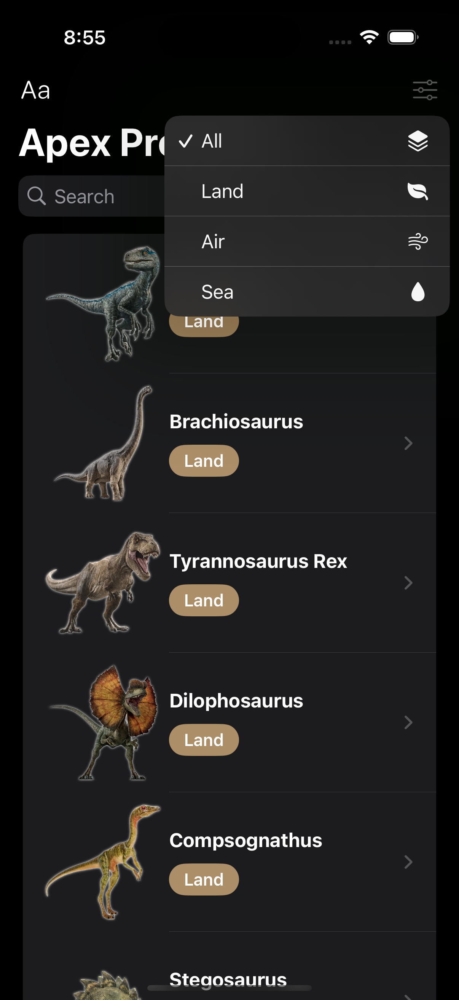
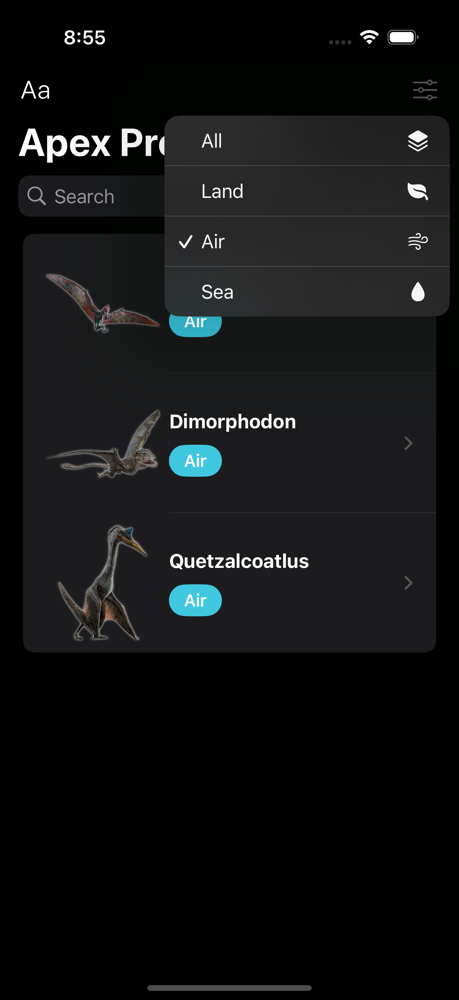

# SwiftUI_Predators
This repo is about a app which displays the dinosaurs featured in Jurassic Park movie. 

    &nbsp;&nbsp;&nbsp;
    &nbsp;&nbsp;&nbsp;
    &nbsp;&nbsp;&nbsp;
    &nbsp;&nbsp;&nbsp;
    &nbsp;&nbsp;&nbsp;
    
  

  
  ## Overview
  Predators is an engaging iOS application built using iOS 18, SwiftUI 6, and Swift 6, designed as part of the course.
This app offers a deep dive into the world of dinosaurs, showcasing their history, characteristics, and appearances in movies. Users can explore detailed profiles of iconic dinosaurs, learn about their habitats, and see which movies they starred in, complete with titles and types.

🚀 Features
Beautiful UI with SwiftUI 6 animations
Dynamic List of top predators with interactive details
Swipe Gestures for smooth navigation
Dark Mode Support for an immersive experience
Offline Access to saved data
This project is a great learning resource for mastering SwiftUI 6 while building an exciting app
  
  
  Based on the Udemy course [iOS 18, SwiftUI 6, & Swift 6: Build iOS Apps From Scratch](https://www.udemy.com/course/ios-15-app-development-with-swiftui-3-and-swift-5/).

