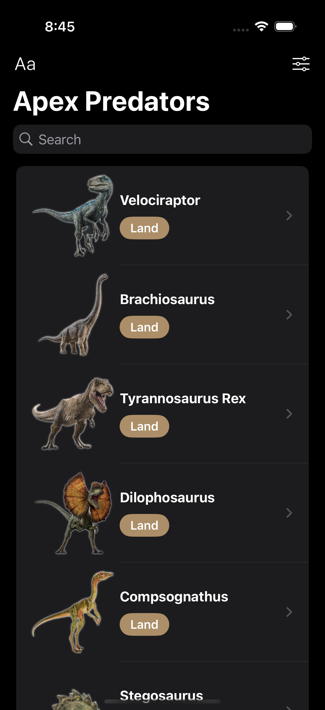
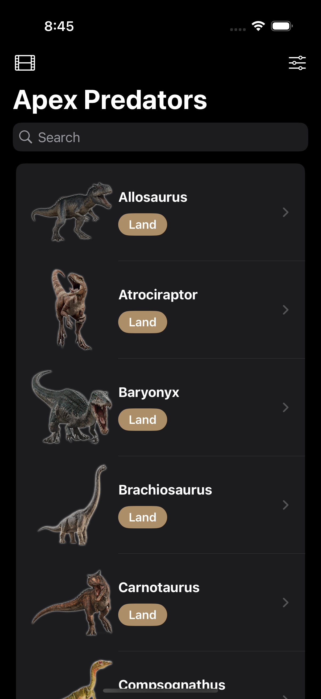
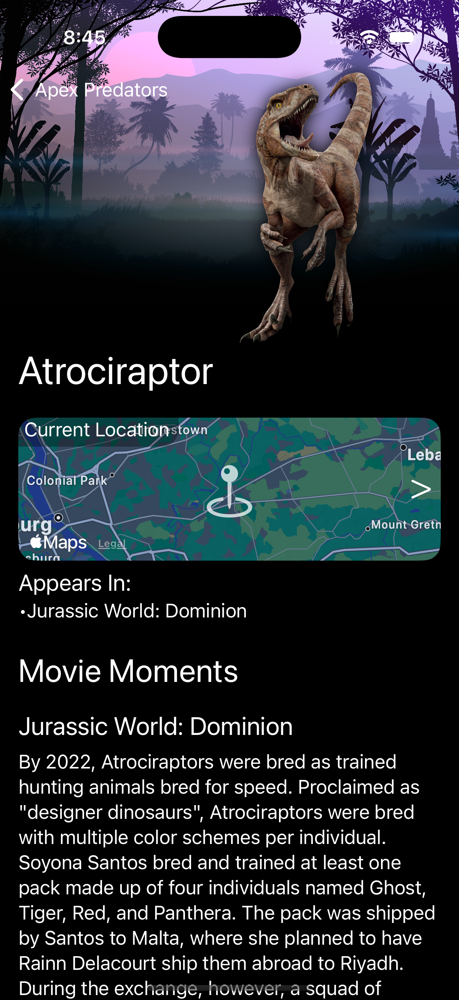

# SwiftUI_Predators
This repo is about a app which displays the dinosaurs featured in Jurassic Park movie. 

    &nbsp;&nbsp;&nbsp;
    &nbsp;&nbsp;&nbsp;
    
    
  

  
  
  Based on the Udemy course [iOS 18, SwiftUI 6, & Swift 6: Build iOS Apps From Scratch](https://www.udemy.com/course/ios-15-app-development-with-swiftui-3-and-swift-5/).

